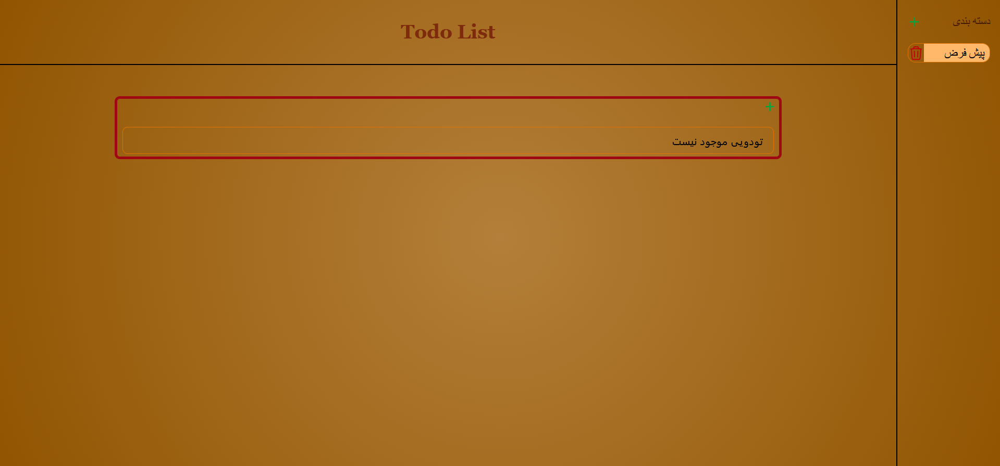

# 📝 Todo List

A simple and practical **Todo List** web application with **category-based task management**, built using **HTML, CSS, Tailwind CSS, and JavaScript**.

In this project, every todo must belong to a specific category. A default category is included by default so users can start adding tasks immediately. All data is saved in the browser using **LocalStorage**.

---

---
## ✨ Features

### 🗂 Category Management
- Add new categories
- Delete categories
- Includes a default category
- Requires selecting a category when adding a new todo

### ✅ Todo Management
- Add todos to any category
- Delete todos
- Displays the creation time for each todo
- Mark todos as completed
- Completed todos are shown with a line-through style
- Click again to return a todo to the uncompleted state

### ⭐ Important Todos
- Mark todos as important
- Important todos display a star icon
- Important todos are always shown at the top of the list

### 💾 Data Persistence
- Saves all data in **LocalStorage**
- Todos and categories remain available after page reload

---